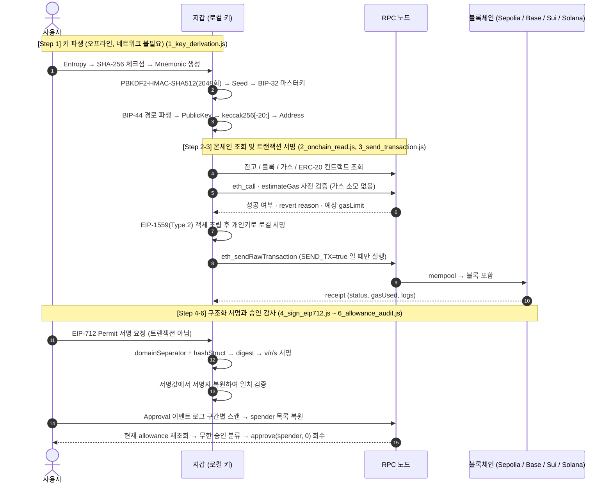

# 멀티체인 HD 지갑 기반 키 파생/트랜잭션 서명/승인 감사 시스템


**2026 블록체인 밋업데이 Wallet 과정(2차)** 실습을 바탕으로, 지갑을 "MetaMask라는 앱"이 아니라 **키 파생 → 서명 → 브로드캐스트 → 영수증**이라는 파이프라인으로 이해하기 위해 각 단계를 직접 구현한 프로젝트입니다. 라이브러리가 대신 처리해 주던 **BIP-39 체크섬 계산**, **BIP-44 주소 파생**, **EIP-1559 트랜잭션 조립**, **EIP-712 digest 구성**을 손으로 재현해 표준값과 대조하고, 교육에서 가장 인상 깊었던 **ERC-20 무한 승인(approve) 리스크**를 추적하는 감사 스크립트를 직접 추가했습니다.

---

## 프로젝트 핵심 요소

1. **키 파생 과정의 직접 구현 및 표준값 검증**
   - 엔트로피 → SHA-256 체크섬 → 11비트 단어 인덱스 → 니모닉 → PBKDF2 시드까지 라이브러리 없이 계산 후 `bip39` 결과와 대조
   - 비압축 공개키를 `keccak256` 한 뒤 마지막 20바이트를 취해 EVM 주소를 직접 파생하고 `ethers` 결과와 일치 여부 검증
   - 같은 니모닉이 EVM / Sui / Solana에서 서로 다른 주소가 되는 이유(파생 경로·타원곡선·인코딩)를 한 화면에서 비교
2. **트랜잭션 라이프사이클 단계별 분리**
   - `eth_call` / `estimateGas` 사전 검증 → nonce·수수료 조회 → EIP-1559(Type 2) 객체 조립 → 로컬 서명 → 브로드캐스트 → 영수증 검증
   - 개인키를 네트워크로 보내지 않고 로컬에서 서명이 끝난다는 점과, 블록 포함(`blockNumber`)과 실행 성공(`status=1`)이 다른 개념임을 확인
   - 기본 동작을 dry-run(서명까지만)으로 설정해 `SEND_TX=true` 를 명시했을 때만 실제 브로드캐스트되도록 구성
3. **서명이 곧 권한이 되는 구조(EIP-712)와 승인 감사**
   - `domainSeparator` 와 `hashStruct` 로 digest를 직접 조립해 `TypedDataEncoder` 결과와 대조하고, 서명값에서 서명자를 복원(`ecrecover`)
   - "가스 없는 로그인"처럼 보이는 Permit 서명이 실제로는 무한 approve인 구조를 코드로 확인
   - `Approval` 이벤트 로그를 블록 구간별로 스캔해 spender 목록을 복원하고, 과거 로그 값이 아닌 **현재 살아있는 allowance** 를 재조회하여 무한 승인을 분류·회수

---

##  시스템 아키텍처 & 라이프사이클 흐름



---

##  기술 스택 (Tech Stack)

| 구분 | 사용 기술 |
|---|---|
| **Runtime & Language** | Node.js 20+, JavaScript (CommonJS) |
| **EVM & Core** | `ethers` v6, EIP-1559(Type 2), EIP-712, ERC-20 / ERC-2612 |
| **Key Derivation** | BIP-39, BIP-32, BIP-44, PBKDF2-HMAC-SHA512, secp256k1 / ed25519 |
| **Multichain SDK** | `@mysten/sui`(gRPC), `@solana/web3.js`, `ed25519-hd-key`, `bip39` |
| **Network** | Ethereum Sepolia, Base Sepolia, Sui Testnet, Solana Devnet |

---

##  트러블슈팅 및 환경 최적화 (Problem Solving)

> **Sui 공식 퍼블릭 풀노드의 JSON-RPC 지원 종료 대응**
> - **문제 상황**: 기존 실습 코드의 `SuiClient` + `https://fullnode.testnet.sui.io` 조합 실행 시, `-32601 Method not found. JSON-RPC on public fullnodes has been deprecated` 오류가 발생하며 조회가 전면 차단되는 문제 발생.
> - **원인 분석**: Sui 재단이 퍼블릭 풀노드의 JSON-RPC 엔드포인트를 종료하고 gRPC로 전환했음을 확인. 또한 `SuiGrpcClient` 의 옵션 키가 `url` 이 아니라 `baseUrl` 이어서, 기존 키를 그대로 넘길 경우 내부 transport에서 `Cannot read properties of undefined (reading 'endsWith')` 가 발생함을 규명.
> - **해결 방안**: `@mysten/sui/grpc` 의 `SuiGrpcClient` 로 교체하고 옵션 키를 `baseUrl` 로 수정하여 조회 복구. 다만 gRPC 클라이언트는 트랜잭션 자동 resolution을 지원하지 않아(`Transaction resolution is not supported with the GRPC client`) Sui는 **조회 전용**으로 범위를 조정.

> **공개 RPC의 이벤트 로그 조회 블록 범위 제한 문제**
> - **문제 상황**: `Approval` 이벤트를 10만 블록 단위로 한 번에 조회하자 공개 RPC가 요청 자체를 거부하여 승인 감사가 불가능한 상태.
> - **원인 분석**: 공개 RPC 제공자가 `eth_getLogs` 호출당 조회 가능한 블록 범위를 제한하고 있으며, 이는 노드 부하 방지를 위한 정책임을 확인.
> - **해결 방안**: `LOG_CHUNK`(기본 9,000 블록) 단위로 구간을 분할해 순회하고, 실패한 구간은 경고만 출력한 뒤 계속 진행하도록 처리. 이 과정을 통해 **지갑 앱들이 왜 별도의 Indexer를 두는지** 를 직접 체감.

> **잔고 0 상태에서 `estimateGas` 선행 실패로 인한 실습 중단 문제**
> - **문제 상황**: faucet으로 테스트넷 ETH를 받기 전에는 `insufficient funds` 로 가스 추정 단계부터 실패해, 트랜잭션 구조 자체를 확인할 수 없는 문제 발생.
> - **원인 분석**: `estimateGas` 는 실제 실행 가능 여부를 검증하므로 잔고 부족 시 예외를 반환하며, 이 예외가 이후 서명 단계까지 차단함을 확인.
> - **해결 방안**: 추정 실패 시 ETH 전송 표준값(21,000)으로 대체하여 **잔고와 무관하게 nonce·chainId·서명 구조 미리보기는 항상 가능** 하도록 처리.

---

##  실행 가이드 (Quick Start)

### 사전 조건 (Prerequisites)
- Node.js 20 이상 설치
- **테스트넷 전용** 니모닉 (실자산이 들어있는 지갑의 니모닉은 절대 사용 금지)

### 1단계: 저장소 클론 및 설치
```bash
git clone https://github.com/Andrewpark-hub/multichain-wallet-lab.git
cd multichain-wallet-lab
npm install
cp .env.example .env      # .env 파일에 MNEMONIC 입력
```

### 2단계: 실습 파이프라인 단계를 순서대로 실행
```bash
# Step 1: 엔트로피 → 니모닉 → 시드 → BIP-44 주소 파생 (.env 없이도 실행 가능)
./run.sh 1

# Step 2: 멀티체인 잔고 및 ERC-20 컨트랙트 조회
./run.sh 2

# Step 3: 트랜잭션 사전 검증 → EIP-1559 조립 → 로컬 서명
./run.sh 3

# Step 4: EIP-712 digest 구성 → 서명 → 서명자 복원
./run.sh 4

# Step 5: ERC-20 승인(approve) 및 회수
SPENDER_ADDRESS=0x... ./run.sh 5

# Step 6: Approval 로그 스캔 → 현재 살아있는 권한 감사
./run.sh 6

# Step 7: 같은 니모닉의 Sui / Solana 주소 파생 및 조회
./run.sh 7
```

### 3단계: 실제 네트워크 전송 (선택)
기본 동작은 서명까지만 수행하는 dry-run입니다. 실제 브로드캐스트는 **명시적으로** 켭니다.
```bash
TO_ADDRESS=0x... ETH_AMOUNT=0.001 SEND_TX=true ./run.sh 3
```

---

##  파일 구조 (Directory Structure)

```text
├── 1_key_derivation.js      # Step 1: 엔트로피 → 체크섬 → 니모닉 → 시드 → BIP-44 주소 파생
├── 2_onchain_read.js        # Step 2: 멀티체인 잔고 / 블록 / 가스 / ERC-20 조회 스크립트
├── 3_send_transaction.js    # Step 3: 사전 검증 → EIP-1559 조립 → 서명 → 전송 → 영수증
├── 4_sign_eip712.js         # Step 4: EIP-712 digest 구성 및 서명자 복원 검증
├── 5_approve_token.js       # Step 5: eth_call 사전 검증 후 ERC-20 승인(approve) 및 권한 회수
├── 6_allowance_audit.js     # Step 6: Approval 로그 스캔 기반 살아있는 권한 감사
├── 7_multichain.js          # Step 7: 동일 니모닉의 Sui / Solana 주소 파생 및 조회
├── shared_data.json         # Step 1에서 생성되어 이후 단계로 전달되는 주소 정보
├── .env.example             # 니모닉 및 RPC 설정 템플릿 (.env는 git 추적 제외)
└── run.sh                   # 단계별 실습 통합 실행 파이프라인
```
